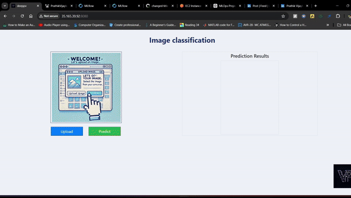

# General Image Classification with deployment
This project is a web application that allows users to upload a photo of a leaf and determines whether it is healthy or unhealthy using a deep learning model. The application showcases a methodical approach to testing and CI/CD, using tools like MLflow, DVC, GitHub Actions, Docker, and AWS.


## Architecture:


### Components:
1. **User**: Uploads a photo via the web application.
2. **Web Application**: Hosted on AWS EC2, pulls the Docker image from AWS ECR, and runs the application.
3. **Model**: Uses a VGG16 model trained on a plant dataset to predict leaf health.
4. **MLflow**: Used for comparing and choosing model parameters during the testing phase.
5. **DVC**: Employed for data and model versioning.
6. **GitHub Actions**: Implements CI/CD to automate testing and deployment.
7. **Docker**: Containerizes the application.
8. **AWS EC2**: Hosts the application.
9. **AWS ECR**: Stores Docker images.



## Technologies Used

- **MLflow**: An open-source platform for managing the end-to-end machine learning lifecycle.
- **DVC (Data Version Control)**: Versioning data and machine learning models to ensure reproducibility.
- **Dagshub**: A collaboration platform for data science and machine learning projects.
- **GitHub Actions**: Automates CI/CD workflows.
- **Docker**: Containerizes the application for consistent deployment.
- **AWS EC2**: Provides scalable compute capacity to host the application.
- **AWS ECR**: A fully managed Docker container registry.


# How to run?
### STEPS:

Clone the repository

```bash
https://github.com/PrathikVijaykumar/Image-classification-Deep-Learning-Project
```
### STEP 01- Create a venv after opening the repository

```bash
python -m venv deepenv
```

```bash
deepenv\Scripts\activate
```


### STEP 02- install the requirements
```bash
pip install -r requirements.txt
```

```bash
# Finally run the following command
python app.py
```

Now,
```bash
open up you local host and port
```


##### cmd
- mlflow ui

### dagshub

Run this to export as env variables:

```bash

export MLFLOW_TRACKING_URI=https://dagshub.com/PrathikVijaykumar/Image-Classification-MLflow-DVC.mlflow

export MLFLOW_TRACKING_USERNAME=PrathikVijaykumar 

export MLFLOW_TRACKING_PASSWORD=XXXXXXXX 

```


### DVC cmd

1. dvc init
2. dvc repro
3. dvc dag


# AWS-CICD-Deployment-with-Github-Actions

## 1. Login to AWS console.

## 2. Create IAM user for deployment

	#with specific access

	1. EC2 access : It is virtual machine

	2. ECR: Elastic Container registry to save your docker image in aws


	#Description: About the deployment

	1. Build docker image of the source code

	2. Push your docker image to ECR

	3. Launch Your EC2 

	4. Pull Your image from ECR in EC2

	5. Lauch your docker image in EC2

	#Policy:

	1. AmazonEC2ContainerRegistryFullAccess

	2. AmazonEC2FullAccess

	
## 3. Create ECR repo to store/save docker image
    - Save the URI: XXX373416292.dkr.ecr.us-west-2.amazonaws.com

	
## 4. Create EC2 machine (Ubuntu) 

## 5. Open EC2 and Install docker in EC2 Machine:
	
	
	#optinal

	sudo apt-get update -y

	sudo apt-get upgrade
	
	#required

	curl -fsSL https://get.docker.com -o get-docker.sh

	sudo sh get-docker.sh

	sudo usermod -aG docker ubuntu

	newgrp docker
	
# 6. Configure EC2 as self-hosted runner:
    setting>actions>runner>new self hosted runner> choose os> then run command one by one


# 7. Setup github secrets:

    AWS_ACCESS_KEY_ID=

    AWS_SECRET_ACCESS_KEY=

    AWS_REGION = us-east-1

    AWS_ECR_LOGIN_URI = XXX373416292.dkr.ecr.us-west-2.amazonaws.com

    ECR_REPOSITORY_NAME = 

